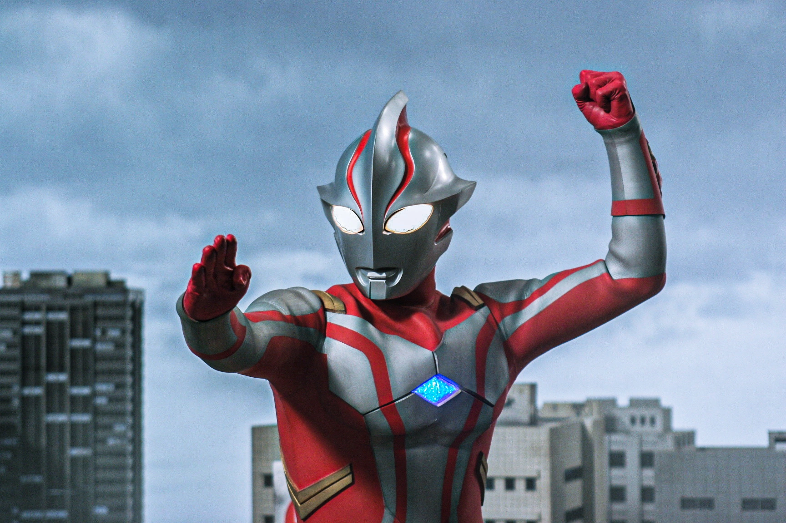

<h1 align="center">🌌 Hello World! | Halo Dunia! 🌏</h1>

  

---

## 🌟 About Me  

👋 Hi there! I'm **Gellslxy / Rigel Nadimaisy**.  

🎓 *Currently Studying At:* **Yogyakarta State University**, undergraduate student.  

🔍 *Exploring:* UI/UX, programming, and creative design.  

🔥 *Passionate About:* Blending technology & education to create engaging and fun learning experiences.  

🤝 *Looking to Collaborate On:* beginner-friendly programming & design projects.  

💡 *Ask Me About:* UI/UX basics, beginner programming journey, or creative workflow.  

📩 *Reach Me At:* [rigelammarusshidqi42@gmail.com](mailto:rigelammarusshidqi42@gmail.com)  

💬 *Motto:* *“God couldn't have brought you this far just to fail.”*  

---

## 💻 Tech Stack & Tools  

  
  
  
  
  
  
  
  
  
  
  
  
  
  
  
  

---

## 📊 GitHub Stats  

  
  

---

## ⚡ Connect With Me  

